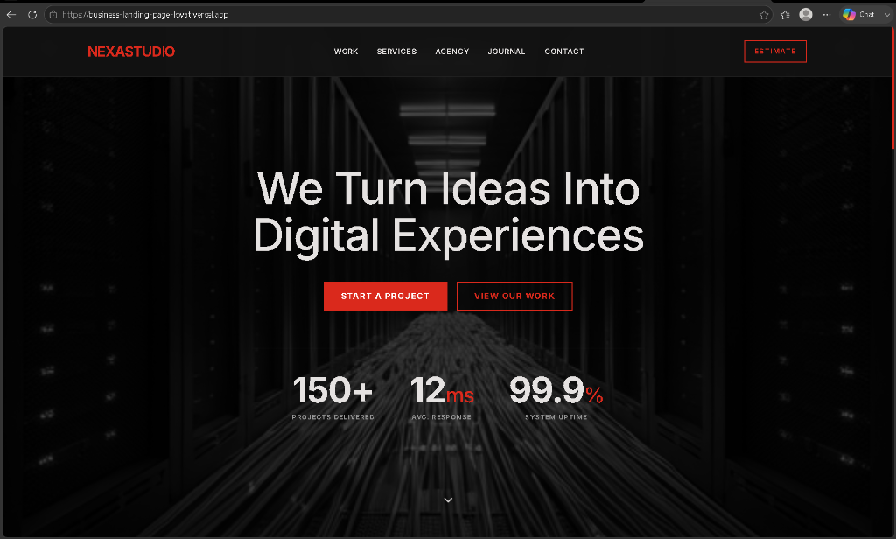
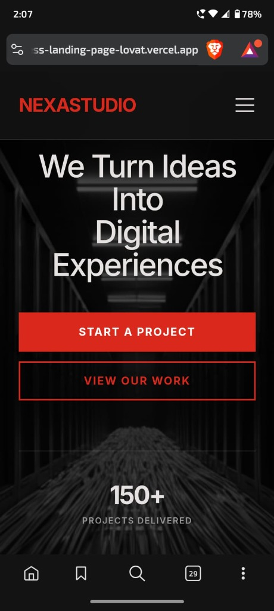
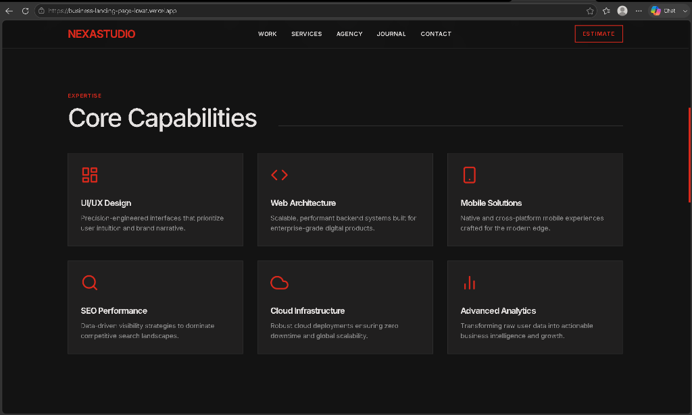
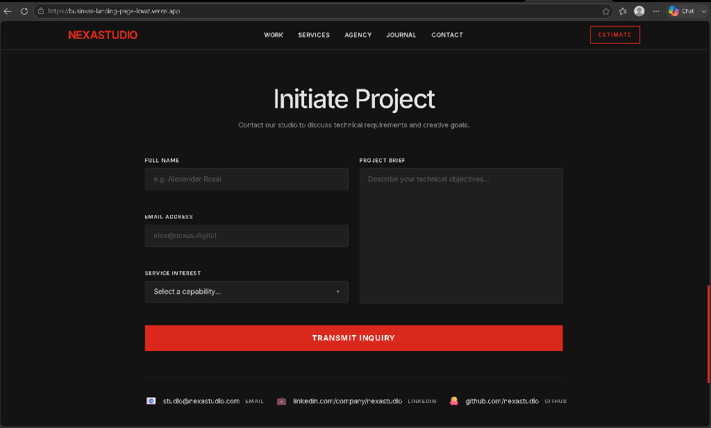

# 🌐 NexaStudio — Business Landing Page

### A precision-crafted responsive landing page built with pure HTML, CSS & JavaScript


---

## 🔗 Live Demo & Preview

👉 **Live Demo:** [https://business-landing-page-lovat.vercel.app](https://business-landing-page-lovat.vercel.app)

📸 **Project Screenshots:**

| Desktop View | Mobile View |
|---|---|
|  |  |

| Services Section | Contact Form |
|---|---|
|  |  |

---

## 🏢 About The Project

NexaStudio is a fictional digital agency landing page built as part of the **WeIntern Pvt Ltd** Web Development Internship curriculum (Week 1, Task 2). The project emphasizes a "Techno-Minimalist" design with professional grid alignments, high-contrast typography, and fluid mobile responsiveness. It is built strictly using semantic HTML5, custom CSS3 variable styling, and Vanilla JavaScript, showcasing performance optimization with zero external dependencies.

---

## 🛠️ Features Table

| Feature | Description | Status |
|---|---|---|
| 📱 Fully Responsive | Works on mobile, tablet, desktop | ✅ |
| 🎨 CSS Animations | Pulse, spin, bounce, fade-in effects | ✅ |
| ♿ Semantic HTML5 | header, nav, main, section, footer | ✅ |
| 📋 Form Validation | Inline JS validation with error messages | ✅ |
| 🌙 Dark Theme | Deep navy + emerald color palette | ✅ |
| 🔄 Smooth Scroll | JS-powered anchor navigation | ✅ |
| 🍔 Hamburger Menu | Mobile nav toggle | ✅ |
| 🍔 Scroll Animations | IntersectionObserver fade-in | ✅ |
| ⚡ Zero Dependencies | No Bootstrap, No Tailwind, No CDN | ✅ |

---

## 📊 Tech Stack Table

| Technology | Purpose |
|---|---|
| HTML5 | Semantic page structure |
| CSS3 | Styling, animations, responsive layout |
| Vanilla JS (ES6+) | Interactivity and DOM manipulation |
| CSS Flexbox | Navigation and single-axis layouts |
| CSS Grid | Services grid and footer layout |
| CSS Variables | Design token system |
| CSS Keyframes | Pulse, spin, bounce animations |
| IntersectionObserver | Scroll-triggered fade-in effects |
| Google Fonts | Space Mono + DM Sans typography |

---

## 📁 Folder Structure

```text
business-landing-page/
├── 📄 index.html          # Main HTML file
├── 📁 css/
│   └── 🎨 style.css       # All styles + animations
├── 📁 js/
│   └── ⚡ script.js       # Interactions + validation
├── 📁 assets/
│   └── 📁 images/         # Image assets
├── 📁 screenshots/
│   ├── 🖥️ landing-desktop.png
│   ├── 📱 landing-hero-mobile.png
│   ├── 🔲 landing-services.png
│   └── 📋 landing-contact-form.png
└── 📝 README.md
```

---

## ⚙️ Sections Overview

| # | Section | Description |
|---|---|---|
| 1 | 🔝 Navbar | Sticky nav with hamburger mobile menu |
| 2 | 🚀 Hero | Full-viewport with grid bg + glows + stats |
| 3 | ⚙️ Services | 6-card responsive grid with hover effects |
| 4 | 🏢 About | 2-col layout with spinning ring animation |
| 5 | 📬 Contact | Validated form + contact info rows |
| 6 | 🔻 Footer | 5-column grid with links |

---

## 🚀 Setup & Run Instructions

1. **Clone the repository:**
   ```bash
   git clone https://github.com/khushi897920-lang/business-landing-page.git
   ```
2. **Navigate to the project directory:**
   ```bash
   cd business-landing-page
   ```
3. **Open in browser:**
   - **Option A:** Simply double-click the `index.html` file to run locally.
   - **Option B:** Right-click `index.html` inside VS Code and choose **"Open with Live Server"**.
4. **For mobile screenshots & previewing:**
   - Open browser **DevTools** (F12 or Right-click -> Inspect).
   - Toggle Device Toolbar using `Ctrl + Shift + M` to test responsiveness.

---

## 📐 Responsive Breakpoints

| Breakpoint | Target | Layout Changes |
|---|---|---|
| > 768px | Desktop | 3-col services, 2-col about, full navbar |
| 768px | Tablet | 2-col services, hamburger menu |
| 480px | Mobile | 1-col everything, stacked footer |

---

## 💼 Internship Context

- **Organization:** WeIntern Pvt Ltd
- **Program:** Summer Internship Program 2025
- **Track:** Full Stack Web Development
- **Week 1 Task 2:** Responsive Business Landing Page
- **Submission includes:** GitHub repo + live link + screenshots + README

---

## 👩‍💻 Author

| | |
|---|---|
| 👩‍💻 Developer | Khushi |
| 🎓 Education | BCA Semester IV, HCPG Varanasi |
| 💼 Internship | WeIntern Pvt Ltd |
| 🐙 GitHub | [github.com/khushi897920-lang](https://github.com/khushi897920-lang) |
| 💼 LinkedIn | [linkedin.com/in/khushi-897920](https://linkedin.com/in/khushi-897920) |

---

## 🤝 Acknowledgements

- **WeIntern Pvt Ltd** for providing this structured internship task and guidance.
- **Google Fonts** for the typography pairing of Space Mono and DM Sans.
- Special thanks to the open-source community for providing standard tools to format layouts and assets.
